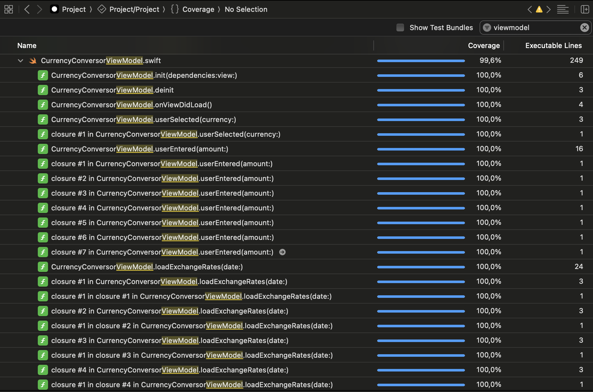
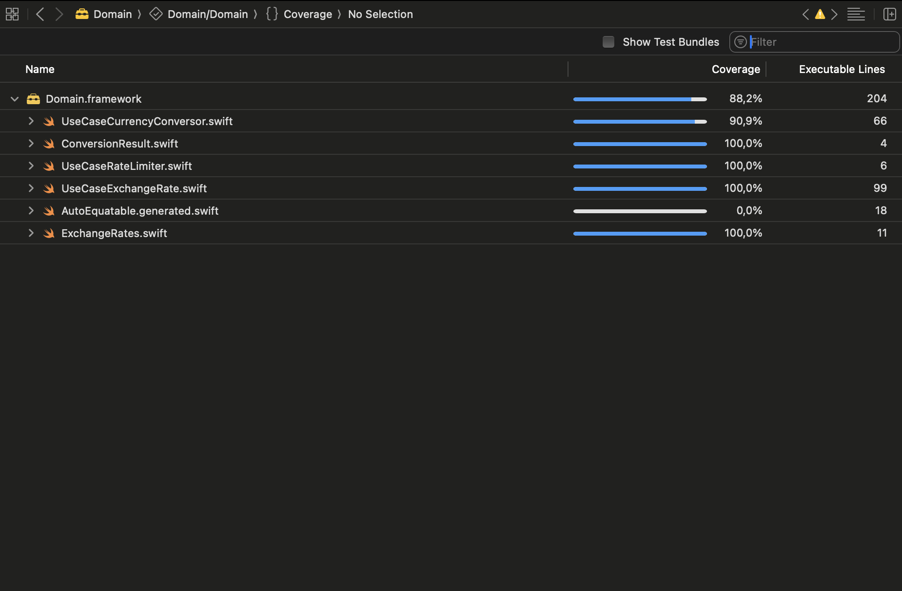
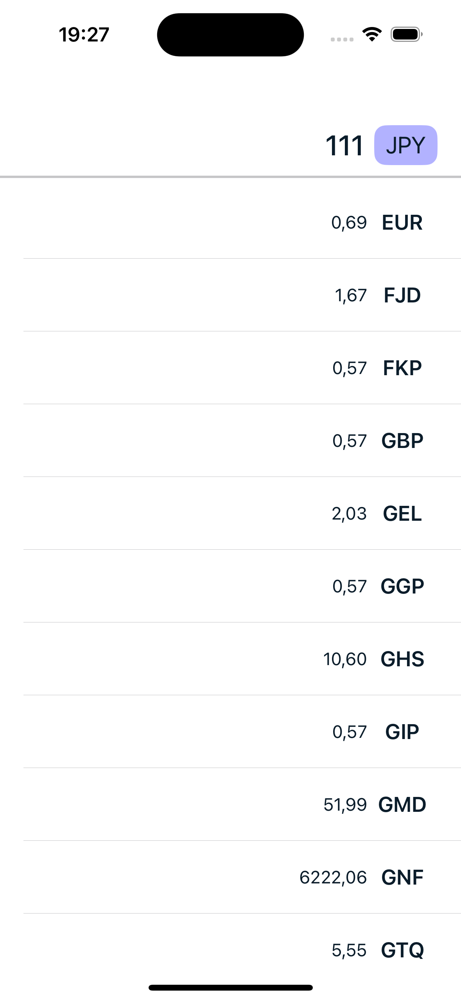
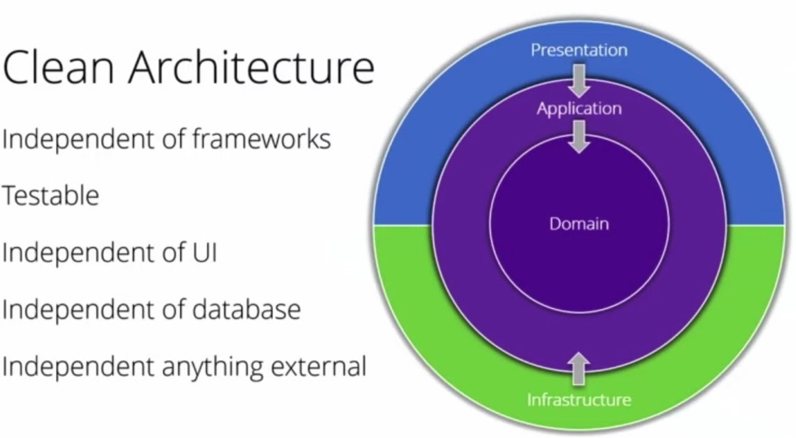
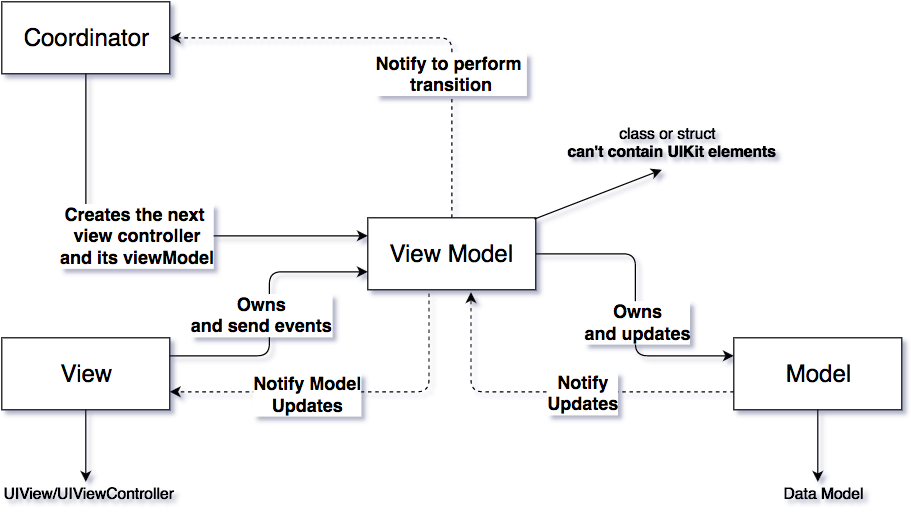
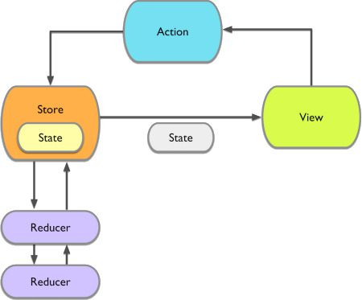

## Project & Architecture

This project was developed as part of a portfolio to showcase my coding style, architecture decisions, and best practices using Swift, UIKit, and Combine. It demonstrates my proficiency in building scalable and testable iOS applications.

**What's the app about?**

The app fetches a list of currencies and conversion rates and presents them in a list pattern. 
Users can search through the list view every rate conversion from the selected base currency.

[Open Exchange API]

## Code Coverage

Only testing files related to business logic, with mocks and meaningful tests

| ViewModel  | Domain  |
|------------|---------|
|  99,6%     |  88,2%  |
|   |    | 

## App Overview

| Init  | Amount  | Currency |  Rates  |
|-------|---------|----------|---------|
|  |  |  |  |  

| In use  |
|---------|
   | 

## Features included

### Git

I adhere to Gitflow for version control, ensuring a clean and manageable release process:

* Main branch + Tags (production releases)
* Develop branch (current working state)
* Feature branches for each feature or improvement
* Hotfixes for urgent production issues, isolated from ongoing development.

Using .gitignore for Swift & Xcode

### Code Style
The project includes a `App > Code > Project > .swiftlint.yml` configuration file to enforce consistent coding standards.
Additionally, I've included a Python script to automate code formatting `App > SyntaxScripts > ./styleMe.py` ensuring a unified style across the project.

### Architecture
This project demonstrates multiple architectural patterns to reflect my adaptability and understanding of different paradigms.

#### Clean architecture

This structure clearly separates concerns, ensuring code is modular, testable, and scalable.

#### MVVM + Navigator + Configurator

- Dependencies: Holds explicit dependencies
- View: UI/UX
- ViewModel: Business logic and state handling
- Model: State definition
- Router/Coordinator: Instantiates the whole module + Navigation in/out

All using SwiftUI & Combine

#### Redux

This app employs a Redux-like pattern for managing state in a predictable way:

- Store: Holds the state and receives actions
- State: Only mutable by actions
- Actions: Triggers for state change
- Reducer: Pure & testeable functions for business logic and calculating the next state given a current state and an action

#### I have also worked with

* VIPER
* Model View ViewModel + RxSwift + UIKit
* Model View Presenter
* SwiftUI + Combine
* State Machines (Effects/Actions)
* ...

### Reactive programming (Combine)
Using Apple's native solution `Combine` for operations for composing, filtering, transforming, and many functional operation while keeping everything synced and reactive in an event based environment

### Log system
I've implemented a custom wrapper around OSLog, allowing logging with different log levels. 
This helps debugging and production monitoring without polluting the release logs.

### Targets
All is split into a clean architecture with frameworks for:
* Project (Views, UIClasses, etc.)
* Domain (Models, classes, use cases and providers)
* Data with specific implementations against different services (API, Disk, Preferences, etc.)

### Dependencies / 3rd Party Frameworks
- Dependencies are kept to the minimum
- Always using Swift Package Manager
- Although I've managed projects with CocoaPods and Carthage.

### Code Autogeneration
Using Sourcery, I automate repetitive tasks such as generating:

- Hashable methods
- Equality checks
- Utility functions for enums
- Init methods automatically from existing properties keeping the access level

This reduces boilerplate and ensures consistency across the codebase.

## Improvements

This project is a sample app and not intended for being production-ready. 
This list is a starting point for further development. By prioritizing these enhancements based on user feedback and project goals, the app can evolve into a robust, scalable, and user-friendly product.
However, potential improvements could include:

### Security Enhancements

#### EXT-01: Securely Store the OpenExchange `appId`
- Store sensitive information in a secure rather than in the source code. 
- Implement encryption secrets.

#### EXT-02: Define Environment-Specific URLs
- Define and use separate base URLs for **development**, **staging**, and **production** environments.
- Extend this change to global configurations if needed.

### User Interface and User Experience (UI/UX)

#### EXT-03: Improve UI Design
- The UI/UX is really minimal and unpolished, just a mimic of the requirements, focusing more on the architecture, code, tests, and style. Implement a more appealing interface that makes it fun to use.
- Use animations and transitions to provide a friendlier experience to the user.

#### EXT-04: Internationalization
- Add localization for supporting multiple languages using localized strings.

#### EXT-05: Enhance Currency Presentation
- Fetch from the API the full list of currencies and human readable names.
- Display them to the user in the UI (e.g., "USD" as "United States Dollar").
- Display the currency symbol next to the amounts where relevant (e.g., "$1,234.56").
- Display a search bar to filter results
- Display an alphabetical scroll like the one in contacts to find currencies better

#### EXT-06: Enforce Input Restrictions in the Amount Field
- Disallow invalid inputs in the text field directly.
- Restrict user input to valid numeric formats:
  - Only numbers and one decimal separator.
  - At most two decimal places.
  - Maximum total length of 'x' characters.

## Functional Enhancements

#### EXT-07: Improve Data Source Transparency
- Display whether the conversion rates were fetched online or loaded from cache.
- Show the last update timestamp prominently in the UI.

#### EXT-08: Allow Custom Base Currency
- Enable users to set a custom base currency for conversions instead of using the default API base.

#### EXT-09: Add History and Favorites
- Implement a feature to save favorite currency pairs for quick access.
- Add a conversion history screen where users can review past calculations.

### Architecture and Scalability

#### EXT-10: Modularize Components
- Separate the Data target into different targets with isolated dependencies if needed.
-  UserDefaults
-  Memory
-  OpenExchangeAPI
-  ...

#### EXT-11: Improve Testing Coverage
- Add automated UI tests for critical workflows.

#### EXT-12: Error Management Standardization
- Define a centralized error handling mechanism with domain-specific error codes.
- Use an error mapper to provide meaningful feedback to the user.

#### EXT-13: Add Logging and Analytics
- Integrate a logging framework for better debugging.
- Implement basic analytics to track feature usage and detect bottlenecks in the user flow.

### Long-Term Features

#### EXT-14: Implement Dark Mode Support
- Ensure the app supports dark mode with proper theming.

#### EXT-15: Add Widgets and WatchOS Support
- Provide a widget to display real-time exchange rates on the Home Screen.
- Create a lightweight Apple Watch app for quick currency conversions.

#### EXT-16: Support Multiple Exchange Rate APIs
- Add flexibility to configure and use different APIs for fetching exchange rates.

#### EXT-17: Enable Biometric Security
- Protect sensitive actions like viewing saved conversions or settings using Face ID or Touch ID.

#### And many more...

- Define a class/framework for dealing with data requests in a common way
   
- Create UI components to be reused (Primary Button, Secondary Button, color scheme, ...)
   
- Include a Changelog for releases

- Make structures conform to Identifiable

- Use a Log system rather that Swift.print to avoid printing in release environments

- If using assets, use a compile-safe tool like R.swift

- Caché images for decreasing the loading time
 
### UI/UX

- Although the scene/module architecture is well-defined
- Create a Navigation pattern and mechanism
- Deeplinks
- Notifications
- Translations
- Localization (distances, weight, currencies, ...)
- Etc.
    
### Analytics & Tracking
- The project already includes swiftlint
- Gather metrics to analyze how users interact with the app
- Include A/B testing
- Feature flag
- Dynamic configuration, on-the-fly for a fast response if a service or a feature suddenly gets interrupted or fails
 
### Continuous Integration

- Certificates & provisioning profiles creation (See Fastlane)
- Run tests before the release
- Notify (Slack, Jira, ...)
- Automatic upload to Testflight or AdHoc distribution
- Include other tests, specially, UI automations for core flows and functionality that run periodically and before every release
* Use the latest stable status from development into a nightly build.
* Release to the store with one click or with every merge into master.  

### Fastlane
* Automate Certificate generation / sharing
* Automate Provisioning profile generation / sharing
* Automate screenshots in different languages
* Automate metadata upload to the App Store
* Automate Binary distribution [AdHoc, Enterprise, Testflight, AppStore]

### Crash system
* Integrate a crash system (Firebase + Crashlytics)

### Push notifications
* Include mock notifications
* Include real notifications

### Unit Testing
* TDD
* Helps writing pure methods / specification

### About me

Feel free to fork this project, contribute, or simply explore the code. If you'd like to discuss it or have any questions, you can reach me at:

[LinkedIn] - My LinkedIn profile

[Email] - Send me an email

I'd appreciate a mention or even a virtual beer if you find my code helpful!

License
----

MIT

## License
Created by Sento Crespo Penadés - sentoCrespo@gmail.com
Copyright (c) 2024 Sento Crespo  All rights reserved.
All images and content are copyrighted to Marvel Entertainment

[Open Exchange API]:https://docs.openexchangerates.org/reference/latest-json
[LinkedIn]:https://www.linkedin.com/in/sentoCrespo
[Email]:mailto:sentoCrespo@gmail.com
